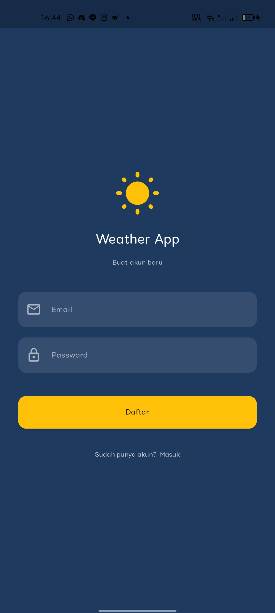
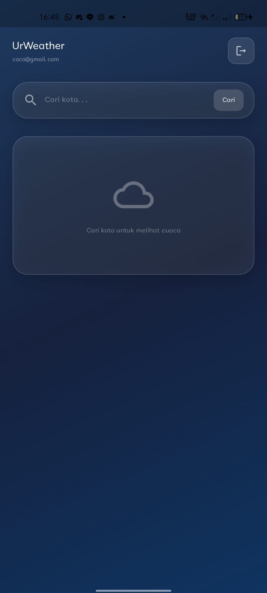
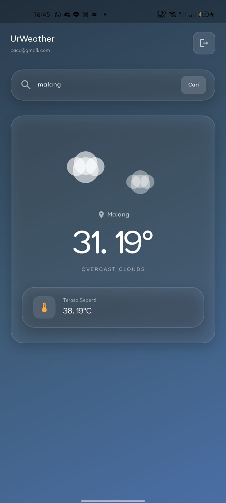
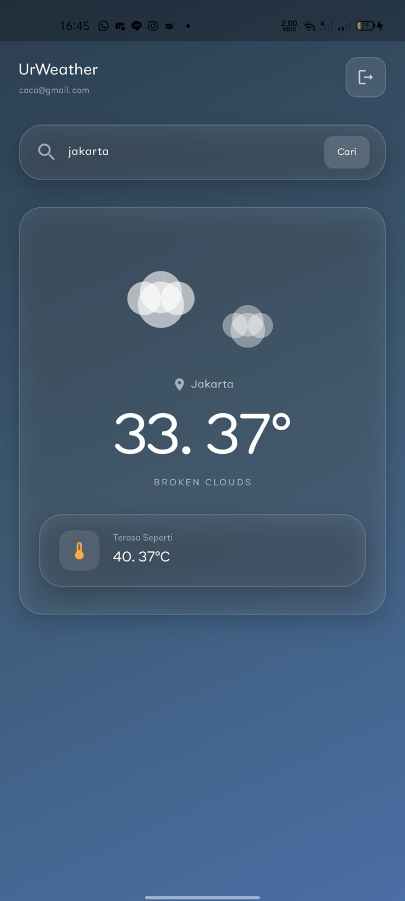

Nafisa Chiquita Finandra Putri | SIB 2G | 18 | 244107060020

# Weather App ☁️

A simple Flutter weather application integrated with **Firebase Authentication** and **OpenWeather API**. Users can register, log in, and search for real-time weather information by city name.

## ✨ Features
- User Registration & Login
- Firebase Authentication
- Search Weather by City
- Display Temperature and Weather Condition
- Logout Function

## 🛠 Technologies Used
- Flutter
- Dart
- Firebase Authentication
- OpenWeather API
- HTTP Package

## Login Page

## Homepage

## Result

